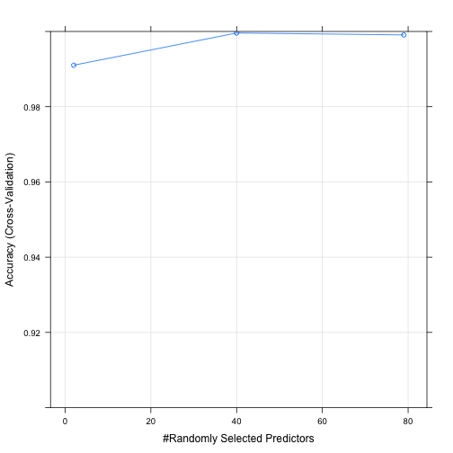

## Background

Using devices such as Jawbone Up, Nike FuelBand, and Fitbit it is now possible to collect a large amount of data about personal activity relatively inexpensively. These type of devices are part of the quantified self movement – a group of enthusiasts who take measurements about themselves regularly to improve their health, to find patterns in their behavior, or because they are tech geeks. One thing that people regularly do is quantify how much of a particular activity they do, but they rarely quantify how well they do it. In this project, your goal will be to use data from accelerometers on the belt, forearm, arm, and dumbell of 6 participants. They were asked to perform barbell lifts correctly and incorrectly in 5 different ways. More information is available from http://groupware.les.inf.puc-rio.br/har (see the section on the Weight Lifting Exercise Dataset). 

## Aim

The goal is to build a machine learning algorithm that can predict the manner in which the participants did the exercise, which is the "classe" variable in the training set.

## Data

The data for this project come from http://groupware.les.inf.puc-rio.br/har. The training data for this project are available here from https://d396qusza40orc.cloudfront.net/predmachlearn/pml-training.csv. The test data are available from https://d396qusza40orc.cloudfront.net/predmachlearn/pml-testing.csv.

# Libraries and data processing

We first load the packages that we'll be using.


```r
library(caret)
library(randomForest)
library(doMC)
```

Then, we read the data and filter out variables with mostly missing values.


```r
traindata = read.csv("traindata", row.names = 1)
testdata = read.csv("testdata", row.names = 1)
```


```r
# Remove near zero covariates
nzvpred = nearZeroVar(traindata, saveMetrics = T)
traindata = traindata[, !nzvpred$nzv]
# Remove variables with more than 80% missing values
missval = sapply(colnames(traindata), function(x) if(sum(is.na(traindata[, x])) > 0.8*nrow(traindata)){return(T)}else{return(F)})
traindata = traindata[, !missval]
```

There are now 57 predictors and 19622 samples.

For the model, we build it via the RandomForest technique, and use 5-fold cross validation with trainControl to optimise the model parameters. The method was chosen after experimenting with other models, which gave the best accuracy. 


```r
set.seed(2)
model = train(classe ~ ., method = "rf", data = traindata, trControl = trainControl(method = "cv", number = 5, allowParallel = TRUE, verboseIter = TRUE))
```


```r
model
```

```
## Random Forest 
## 
## 19622 samples
##    57 predictor
##     5 classes: 'A', 'B', 'C', 'D', 'E' 
## 
## No pre-processing
## Resampling: Cross-Validated (5 fold) 
## 
## Summary of sample sizes: 15698, 15697, 15698, 15696, 15699 
## 
## Resampling results across tuning parameters:
## 
##   mtry  Accuracy   Kappa      Accuracy SD   Kappa SD    
##    2    0.9910305  0.9886532  0.0021953959  0.0027768880
##   40    0.9995923  0.9994844  0.0002277852  0.0002880978
##   79    0.9990826  0.9988397  0.0003866413  0.0004890439
## 
## Accuracy was used to select the optimal model using  the largest value.
## The final value used for the model was mtry = 40.
```

```r
plot(model, ylim = c(0.9, 1))
```

 


As you can see from the results and the plot, the in-sample accuracy of the model is extremely close to 1. We also identified the top 5 predictors as raw_timestamp_part_1, num_window, roll_belt, pitch_forearm, magnet_dumbbell_z. Our out of sample error is also insignificant.

# Prediction and Coursera submission

```r
model$finalmodel
prediction = as.character(predict(model, newdata = testdata))
```


```r
pml_write_files = function(x){
  n = length(x)
  for(i in 1:n){
    filename = paste0("problem_id_", i, ".txt")
    write.table(x[i], file = filename, quote = FALSE, row.names = FALSE, col.names = FALSE)
  }
}
pml_write_files(prediction)
```


